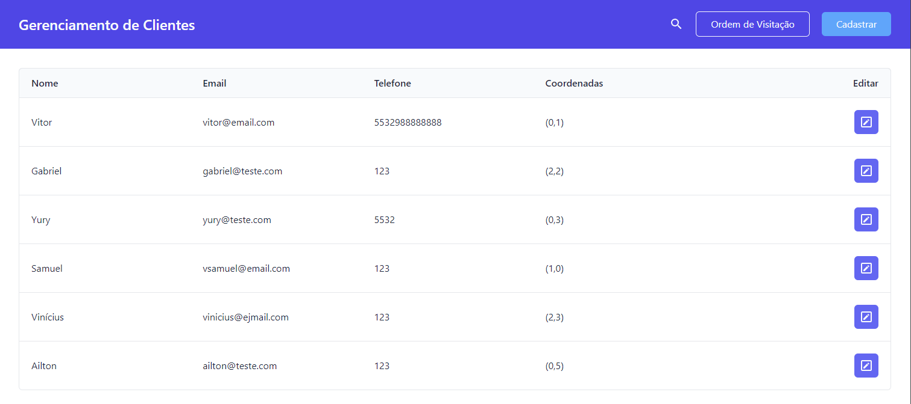
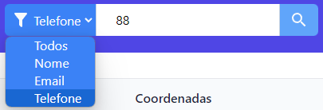
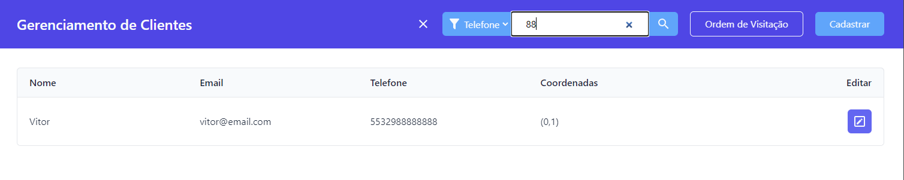
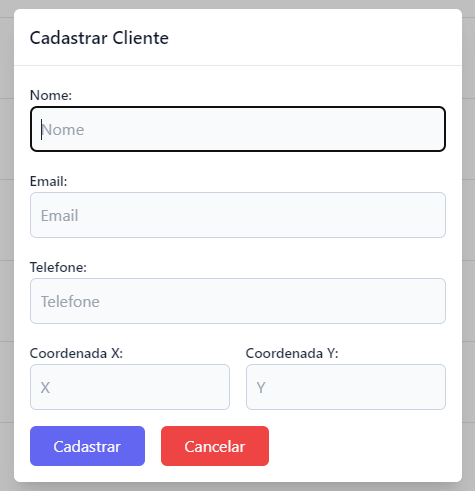
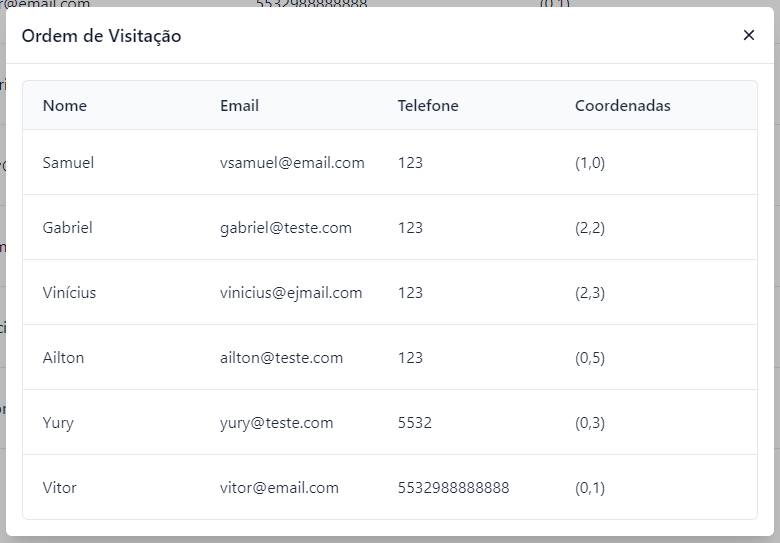

# React-ClientsManagement

Repositório contendo projeto de teste de programação para a empresa Facilita Jurídico. O projeto consiste de um sistema onde é possível gerenciar os clientes de uma empresa de limpezas, desenvolvido utlizando React no frontend e Node.js e PostgreSQL no backend

## Especificações do teste

- **Parte 1**  
    Uma empresa que realiza limpeza em residências enfrenta desafios no gerenciamento de seus clientes e busca uma solução eficiente para cadastrar e visualizar as informações que hoje são controladas em planilhas. Para centralizar as informações e ajudar na expansão da empresa, ela deseja uma plataforma onde seja possível gerenciar os seus clientes. O sistema deve ser composto por um backend em Node.js utilizando PostgreSQL como banco de dados, e um frontend em React.

    A empresa utiliza as seguintes informações para gerenciar seus clientes: nome, email e telefone.

    Na plataforma criada deve ser possível:  
        - Listar os seus clientes e filtrar com base nas informações cadastradas
        - Cadastrar clientes novos
- **Parte 2**  
    Suponha que, além de cadastrar e visualizar clientes, a empresa deseja otimizar as rotas de atendimento para maximizar a eficiência na visitação dos clientes. Considere um mapa bidimensional representando a localização dos clientes, onde cada ponto cartesiano possui um cliente. Cada cliente cadastrado possui uma coordenada X e uma coordenada Y nesse mapa.

    O objetivo é calcular a rota partindo da empresa (0,0) e que passe pela localização de todos os clientes cadastrados no banco de dados e retorne à empresa no final. A rota deve ser calculada para ter a menor distância possível.

    O algoritmo para calcular essa rota deve estar disponibilizado via rota da api para ser chamado pelo front quando necessário.

    Implemente um botão na tela de clientes que, ao ser clicado, abre uma modal e mostra a ordem de visitação dos clientes na rota calculada. A visualização pode ser a mais simples possível mostrando uma lista dos clientes na ordem que devem ser visitados do primeiro ao último cliente da rota.

    Ao desenvolver essa segunda parte, altere a rota de cadastro e visualização para que seja possível cadastrar e visualizar as coordenadas X e Y dos clientes da empresa.

## Requisitos

- [Node.js](https://nodejs.org/en)
- [PostgreSQL](https://www.postgresql.org/)

## Como rodar

Após certificar-se de que os requisitos foram cumpridos, verifique se o banco de dados está rodando.
O projeto foi feito utilizando `pnpm`, mas pode rodar também com `npm` (npm já vem instalado junto com o Node.js):

- ### Backend

    Dentro da pasta Backend, siga os passos (rodando os comandos em um terminal):

    1. Instale as dependências do projeto:  
        Com pnpm:  
        `pnpm install`  

        Com npm:  
        `npm install`

    2. Configure o arquivo `.env`:  
        Um arquivo `.env` já está criado na pasta `frontend`, contendo as seguintes variáveis:  
        `DATABASE_URL` e `PORT`, que são respectivamente, a URL de conexão do banco e a porta em que o servidor irá rodar.  
        Na configuração padrão, o banco estará rodando na porta 5432, no usuário postgres, com senha postgres e database postgres. O servidor rodará na porta 8080.
        Altere de acordo com a configuração de seu banco e porta desejada.

    3. Rode o servidor:  
        Com pnpm:  
        `pnpm run dev`  

        Com npm:  
        `npm run dev`

    **OBS.:**: Quando o servidor é iniciado, a tabela `clients` será criada automáticamente no banco de dados.

- ### Frontend

    Dentro da pasta Frontend, siga os passos (rodando os comandos em um terminal):

    1. Instale as dependências:  
        Com pnpm:  
        `pnpm install`  

        Com npm:  
        `npm install`

    2. Configure o arquivo `.env`:  
        Um arquivo `.env` já está criado na pasta `frontend`, contendo as seguintes variáveis:  
        `VITE_BASEURL` e `VITE_PORT`, que são respectivamente, a URL base e a porta do servidor.  
        Altere de acordo com a configuração de seu servidor.

    3. Rode o projeto:  
        Com pnpm:  
        `pnpm run dev`  

        Com npm:  
        `npm run dev`

    4. Acesse a URL:
        Após rodar o projeto, em caso de sucesso, a URL de acesso ao frontend aparecerá no terminal.  
        Geralmente o projeto é iniciado na porta 5173, porém, pode mudar caso a porta esteja ocupada.  
        Ex.: `http://localhost:5173`
  
Pronto, em caso de sucesso, a aplicação já estará funcionando.  

## Imagens da Aplicação  

Tela Principal:  

Opções de Filtro:  

Filtro por Telefone:  

Modal de Cadastro:  

Modal de Ordem de Visitação:  

